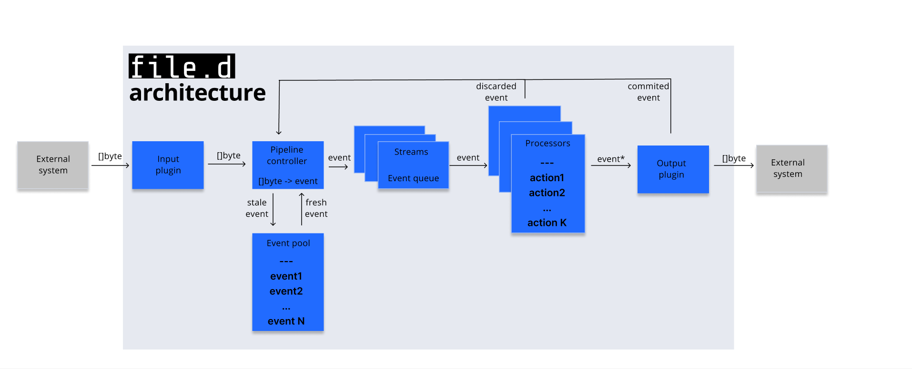

# Architecture 

Here is a bit simplified architecture of the **file.d** solution. 

What's going on here:

- **Input plugin** pulls data from external systems and pushes next to the pipeline controller. Full list of input plugins available is [here](../plugin/input).
- The **pipeline controller** is in charge of converting data to event and subsequent routing.
- The **event pool** provides fast event instancing. 
- Events are processed by one or more **action plugins**; they act on the events which meet particular criteria.
- Finally, the event goes to the **output plugins** and is dispatched to the external system.  

You can extend `file.d` by adding your own input, action, and output plugins. 